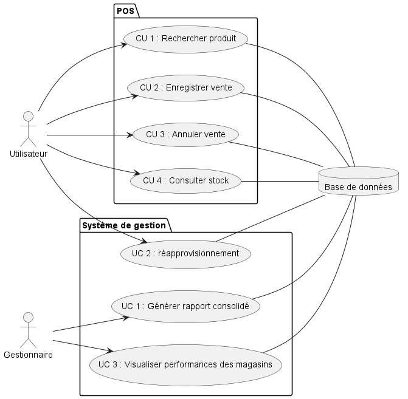
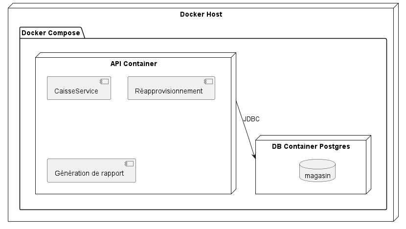
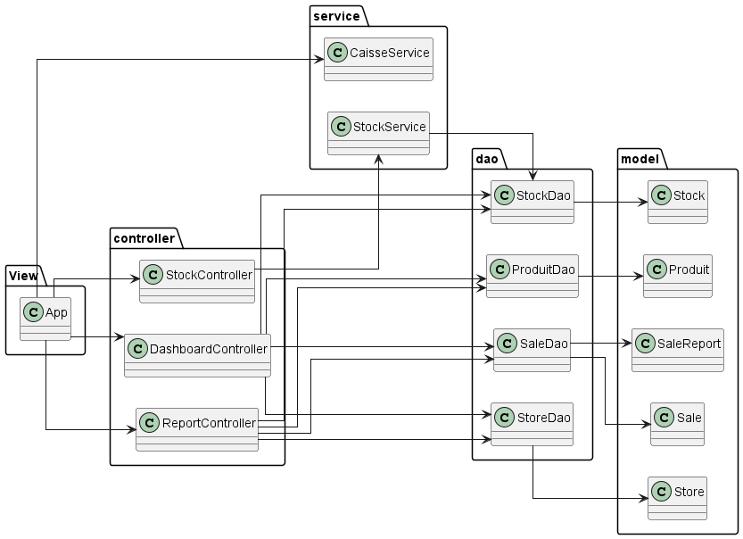
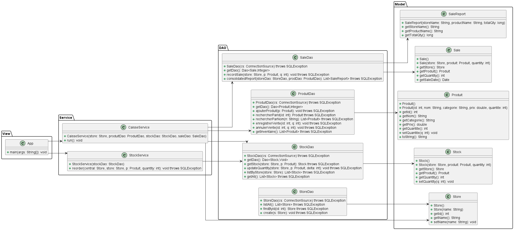
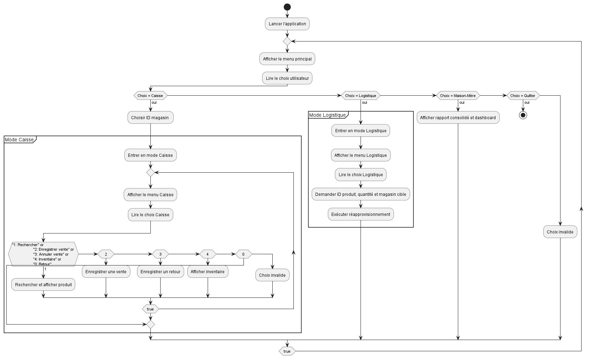

- Nom : Youcef mekki daouadji  LOG430-02 
- Code permanent : MEKY03039908
- URL github : mdyoucef99/LAB2_LOG430

# Rapport pour le LABO2 LOG430 :  
## Évolution d’une architecture logicielle plus scalable et flexible

---

## Explication de ce projet

Ce laboratoire représente le cumul des LAB0, LAB1 et LAB2.

- **LAB0** : Création du squelette du projet, mise en place d’un pipeline CI/CD avec GitHub Actions, et configuration de la machine virtuelle servant d’environnement de production.
- **LAB1** : Implémentation d’un système de vente assurant la persistance des données, même avec plusieurs caisses fonctionnant simultanément.
- **LAB2** : Amélioration de la scalabilité du projet en intégrant la gestion de plusieurs magasins, d’une maison mère et d’un centre logistique, chacun ayant des fonctionnalités spécifiques.

---

## Instructions d'exécution


## Exécution de l’application
Dans la VM, le dossier racine ce trouve dans le fichier projects/LAB2_LOG430 .Assurez vous de faire un git -pull pour avoir la derniere version du repo : mdyoucef99/LAB2_LOG430

## Tests unitaires

Les bibliothèques JUnit se trouvent dans le dossier `lib` (`junit-4.13.2.jar` et `hamcrest-core-1.3.jar`). Depuis le dossier racine :

```bash
# Compiler le test
javac -d javac -d LABO2/lab/bin -cp "lib/junit-4.13.2.jar:lib/hamcrest-core-1.3.jar" LABO2/lab/tests/lab/tests/AppTest.java

# Exécuter le test
java -cp "LABO2/lab/bin:lib/junit-4.13.2.jar:lib/hamcrest-core-1.3.jar" org.junit.runner.JUnitCore lab.tests.AppTest
```

## Conteneurisation

Construisez et testez l’image Docker localement :

```bash
docker build -t lab2_api .
docker run --rm -it --network host lab2_api
```

## Orchestration avec Docker Compose

Il existe un `docker-compose.yaml` à la racine, lancez :

```bash
docker-compose build
docker-compose up -d 
docker-compose run --rm api
```

**Résultat attendu :** 

Vous devriez maintenant être capable de lancer l'application et d'accéder aux options dans la base de données qui est conteneurisée. 

### Lancement de l'application

L'application se présente sous forme de console offrant trois options principales au démarrage :

1. **Caisse (magasin)**
2. **Centre logistique** (UC2)
3. **Maison-Mère** (UC1 & UC3)

---

### 1. Caisse (magasin)

Après avoir sélectionné cette option, il vous sera demandé de choisir l'**ID du magasin** (valide de 1 à 5). Une fois sélectionné, vous accéderez au système de caisse, où vous pouvez :

- Rechercher un produit par ID
- Enregistrer une vente
- Annuler une vente
- Consulter l'inventaire du magasin

Suivez simplement les instructions affichées dans la console pour chaque action.

---

### 2. Centre logistique (UC2)

Cette option vous donne accès au **centre logistique**, responsable du **réapprovisionnement** des magasins. Vous pouvez consulter les stocks centraux et initier une demande d'approvisionnement si un produit est insuffisant dans un magasin.

---

### 3. Maison-Mère (UC1 & UC3)

La Maison-Mère permet de :

- Générer un **rapport consolidé** des ventes par magasin
- Visualiser les **stocks de tous les magasins**
- Identifier les **produits en rupture de stock**
- Afficher les **chiffres d’affaires** et autres indicateurs de performance

> Le rapport est généré et affiché directement dans la console à l’aide de `System.out.println`, contenant les informations essentielles.

Pour arrêter les services :

```bash
docker-compose down
```

La pipeline CI/CD est configurée via **GitHub Actions** et se déclenche à chaque push ou merge request. Elle exécute dans l’ordre :

1. **Lint** (Checkstyle)
2. **Tests unitaires** (JUnit)
3. **Build & publication** de l’image Docker 

Pour suivre l’exécution, ouvrez le dépôt et consultez la section **Actions**.

---

## Justification des choix technologiques retenus

- **Langage de programmation** : Java — stable, bien documenté, facile à implémenter.
- **Abstraction de la couche de persistance** : ORMLite — simple d’utilisation, adaptée à un projet de cette taille.
- **Base de données** : PostgreSQL — robuste, conforme aux propriétés ACID.
- **Tests** : JUnit — outil de référence pour les tests unitaires en Java.
- **CI/CD** : GitHub Actions — pipeline facilement configurable avec Java.

---

## Décisions d’architecture (ADRs)

Les ADRs sont disponibles dans le dossier `docs/ADR`.

# ADR1 : Choix de l’ORM léger (ORMLite)

## CONTEXTE
Nous devons persister nos entités Java (`Store`, `Produit`, `Stock`, `Sale`) dans une base PostgreSQL avec un minimum de code de mapping. 

## Décision
Adopter **ORMLite** pour :
- Annoter directement les classes avec `@DatabaseTable`/`@DatabaseField`.  
- Générer automatiquement DAOs via `DaoManager`.  

## Status
Accepté

## Conséquences
- **+** Très rapide à mettre en place, peu de configuration.  
- **+** Réduit la quantité de code SQL. 
- **–** Fonctionnalités limitées par rapport à d'autre ORM mais dans notre cas celui-ci sera correct.


Référence template : Decision record template by Michael Nygard (https://github.com/joelparkerhenderson/architecture-decision-record/tree/main/locales/en/templates/decision-record-template-by-michael-nygard)

# ADR2 : Utilisation du patron MVC                                                                 

## CONTEXTE
Dans le contexte du labo 2, nous avons besoin de séparer les données, la logique de traitement et l’interface, qui, dans notre cas, représente la console CLI. En utilisant le patron MVC, nous pouvons diviser les parties de notre projet, ce qui facilite les tests et permettra, à l’avenir, d’améliorer le projet sans trop de difficulté.

## Décision
Organiser l’application en **MVC** :
- **Model** (`model`): entités ORMLite pures.  
- **View** (`View`): Interface CLI. 
- **Controller** (`controller`): traduit les requêtes de l'interface utilisateur en consigne dans le cas de RepportController et DashbaordController 
- **Service** (`service`): Logique offrant les service nécessaire pour les stocks et la caisse 


## Status
Accepté

## Conséquences
- **+** Code découplé : UI, logique et Entité isolées.  
- **+** Tests unitaires plus simples sur chaque couche.    
- **–** Beaucoup de classe vu que la logique est réparties sur plusieurs classes.


Référence template : Decision record template by Michael Nygard (https://github.com/joelparkerhenderson/architecture-decision-record/tree/main/locales/en/templates/decision-record-template-by-michael-nygard)

---

## Diagrammes UML 4+1

Les diagrammes UML sont disponibles dans le dossier `docs/UML`.

### Diagramme de cas d'utilisation



### Diagramme de déploiement



### Vue d'implémentation



### Vue logique



### Vue processus




